

# 🌿 Plant Image Classification Using Teachable Machine

**A clean and simple image classification activity for identifying 20 plant species using Google Teachable Machine**

---

## 📖 Project Overview

This project focuses on developing an image classification model using **Google Teachable Machine** to recognize **20 related plant species** from images. The model was trained to learn the unique visual features of each plant species and classify them based on the uploaded image.

The main goal of this activity is to make plant identification easier and more efficient through image classification. This README also presents the **training details**, **evaluation results**, **testing examples**, and **reflection questions** to clearly show the overall performance of the model.

---

## 🌱 Plant Species Used

Below are the **20 plant species** used in this project. Each plant includes a representative image, its common name, scientific name, and a short description.

---

### 1. Beach Morning Glory

  

**Common Name:** Beach Morning Glory  
**Scientific Name:** *Ipomoea pes-caprae*

A creeping coastal vine commonly found on sandy beaches. It is known for its broad leaves and purple trumpet-shaped flowers.

---

### 2. Scaevola

  

**Common Name:** Scaevola  
**Scientific Name:** *Scaevola taccada*

A coastal shrub with thick green leaves and small white flowers. It is commonly found near shorelines and helps protect coastal areas.

---

### 3. Beach Pandan

  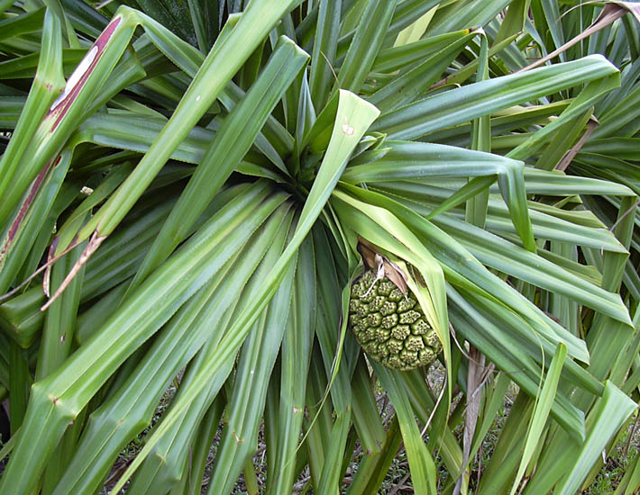

**Common Name:** Beach Pandan  
**Scientific Name:** *Pandanus tectorius*

A tropical coastal plant with long spiny leaves and large fruit clusters. It grows well in sandy and seaside environments.

---

### 4. Beach Spinifex Grass

  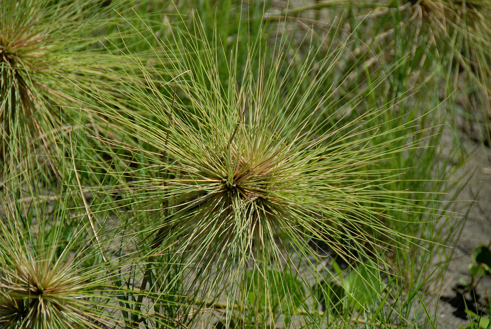

**Common Name:** Beach Spinifex Grass  
**Scientific Name:** *Spinifex littoreus*

A fast-spreading grass that grows on sand dunes. It helps stabilize sandy soil along the coast.

---

### 5. Seaside Heliotrope

  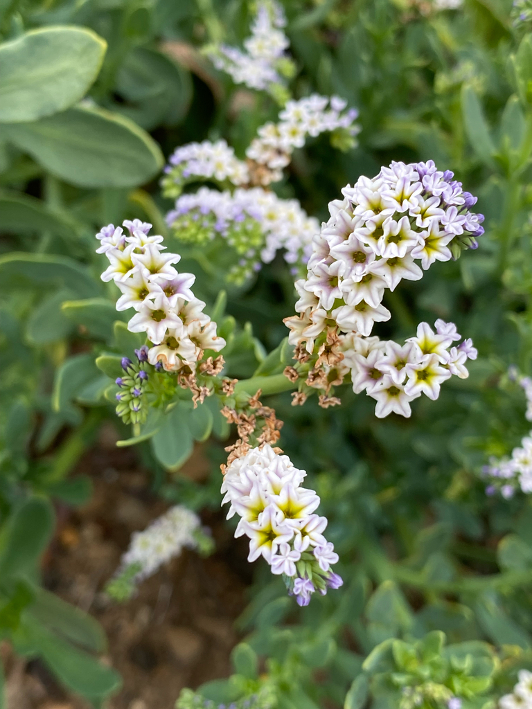

**Common Name:** Seaside Heliotrope  
**Scientific Name:** *Heliotropium curassavicum*

A low-growing coastal plant with fleshy leaves and small flowers. It thrives in salty environments near the shore.

---

### 6. Beach Bean

  

**Common Name:** Beach Bean  
**Scientific Name:** *Canavalia rosea*

A trailing vine that grows on sandy beaches. It has thick leaves and pink to purple flowers.

---

### 7. Sea Purslane

  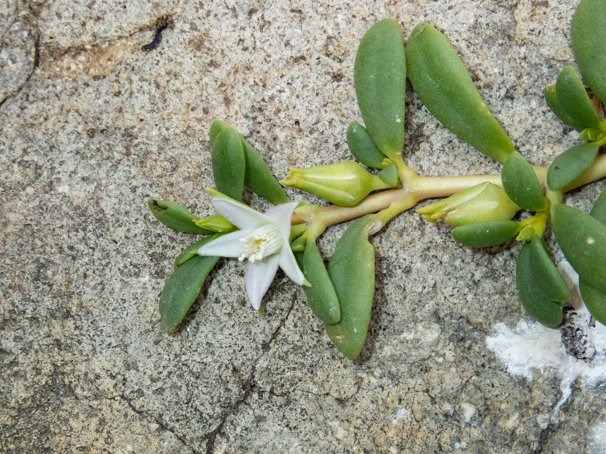

**Common Name:** Sea Purslane  
**Scientific Name:** *Sesuvium portulacastrum*

A creeping succulent plant with fleshy leaves. It is well adapted to coastal habitats and salty soil.

---

### 8. Beach Pea

  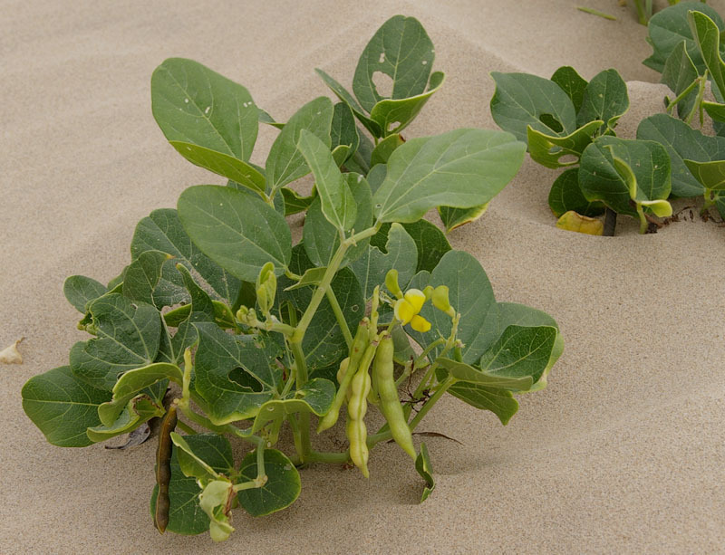

**Common Name:** Beach Pea  
**Scientific Name:** *Vigna marina*

A coastal legume vine with yellow flowers. It commonly grows on sandy shores and open beach areas.

---

### 9. Beach Lily

  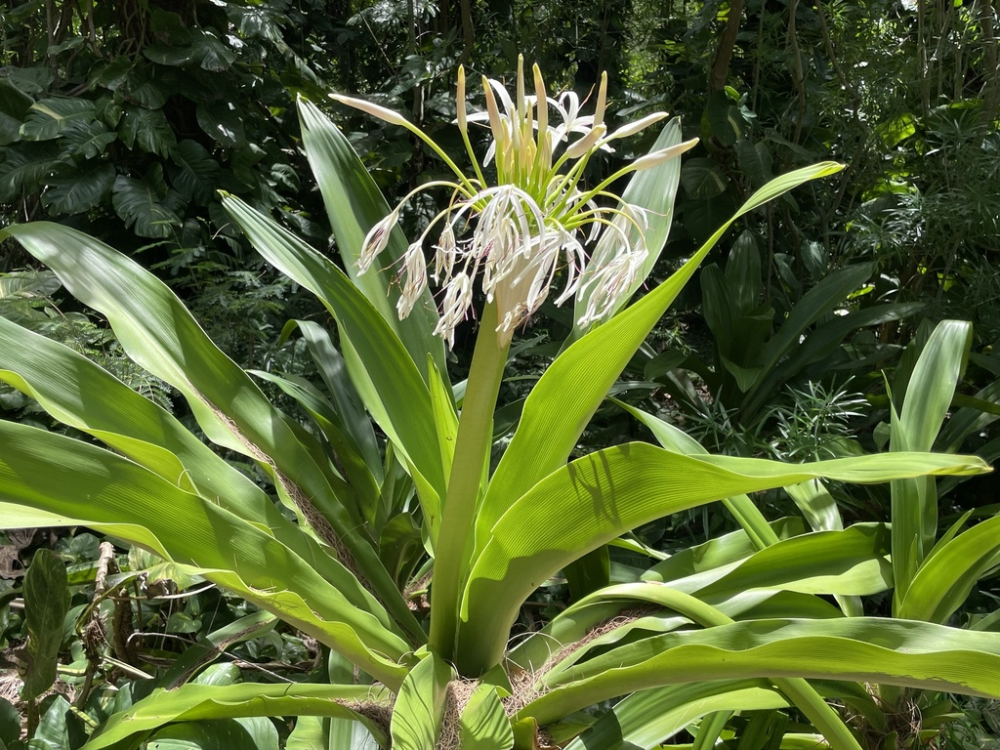

**Common Name:** Beach Lily  
**Scientific Name:** *Crinum asiaticum*

A flowering coastal plant with long leaves and large white blooms. It is often found in tropical seaside areas.

---

### 10. Seaside Goldenrod

  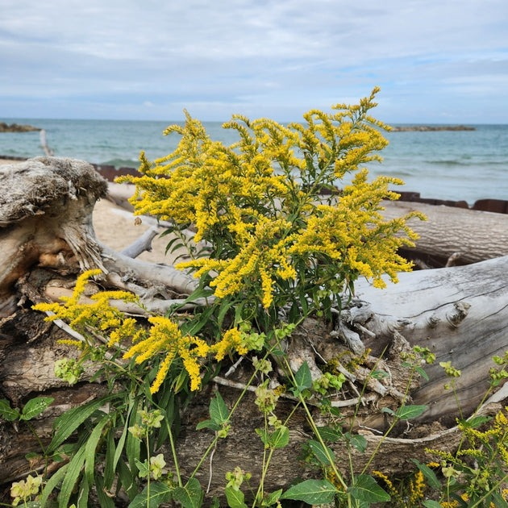

**Common Name:** Seaside Goldenrod  
**Scientific Name:** *Solidago sempervirens*

A flowering coastal plant recognized by its bright yellow flower clusters. It is commonly found near dunes and shorelines.

---

### 11. Bay Cedar

  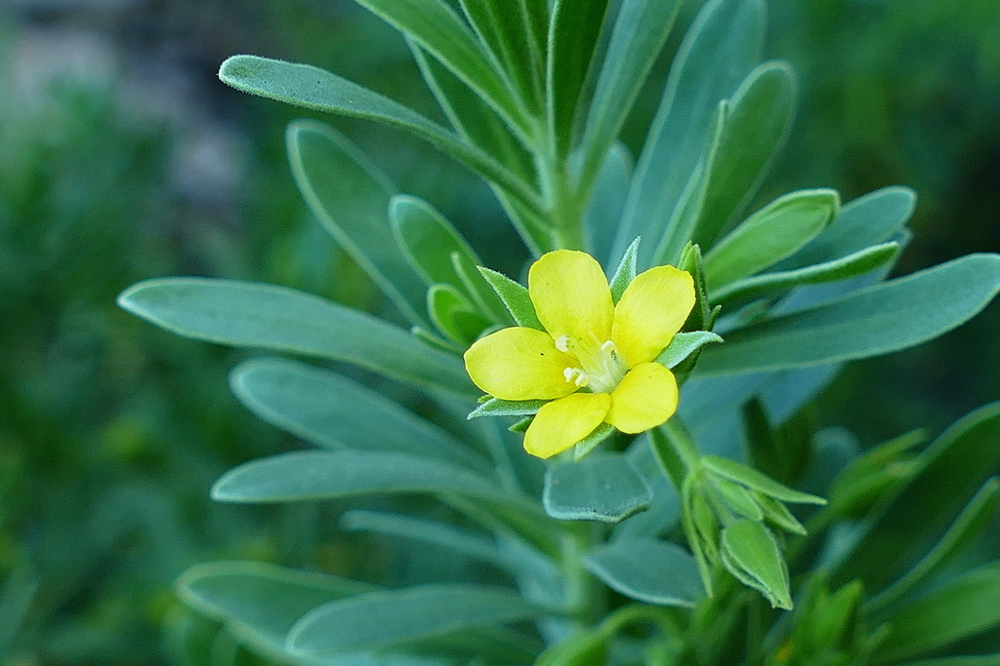

**Common Name:** Bay Cedar  
**Scientific Name:** *Suriana maritima*

A small coastal shrub with woody branches and yellow flowers. It grows in dry sandy places near the sea.

---

### 12. Yellow Necklace Pod

  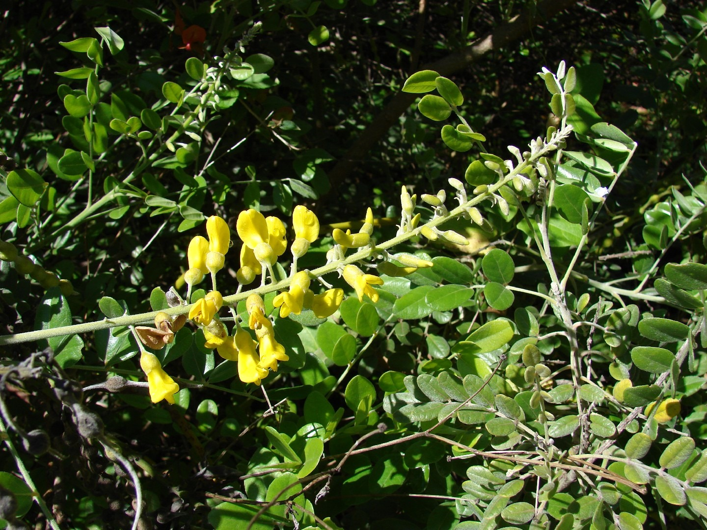

**Common Name:** Yellow Necklace Pod  
**Scientific Name:** *Sophora tomentosa*

A coastal shrub with yellow flowers and bead-like seed pods. It is commonly found in sandy and salty environments.

---

### 13. Sea Rocket

  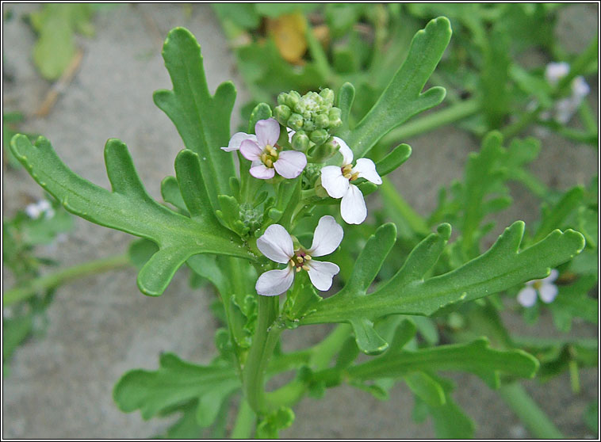

**Common Name:** Sea Rocket  
**Scientific Name:** *Cakile maritima*

A hardy coastal plant that grows on sandy beaches. It has fleshy leaves and is well adapted to seaside conditions.

---

### 14. Saltwort

  

**Common Name:** Saltwort  
**Scientific Name:** *Batis maritima*

A salt-tolerant coastal plant with small thick leaves. It is commonly found in marshes and other salty habitats.

---

### 15. Beach Rattlebox

  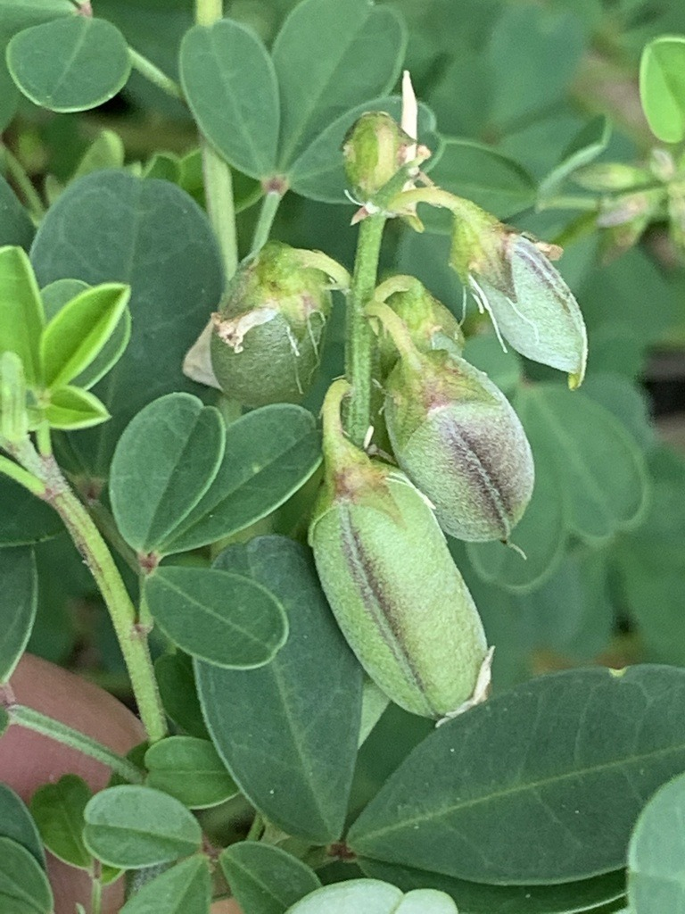

**Common Name:** Beach Rattlebox  
**Scientific Name:** *Crotalaria pumila*

A small coastal flowering plant with yellow blossoms. Its seed pods make a rattling sound when dry.

---

### 16. Red Sand Verbena

  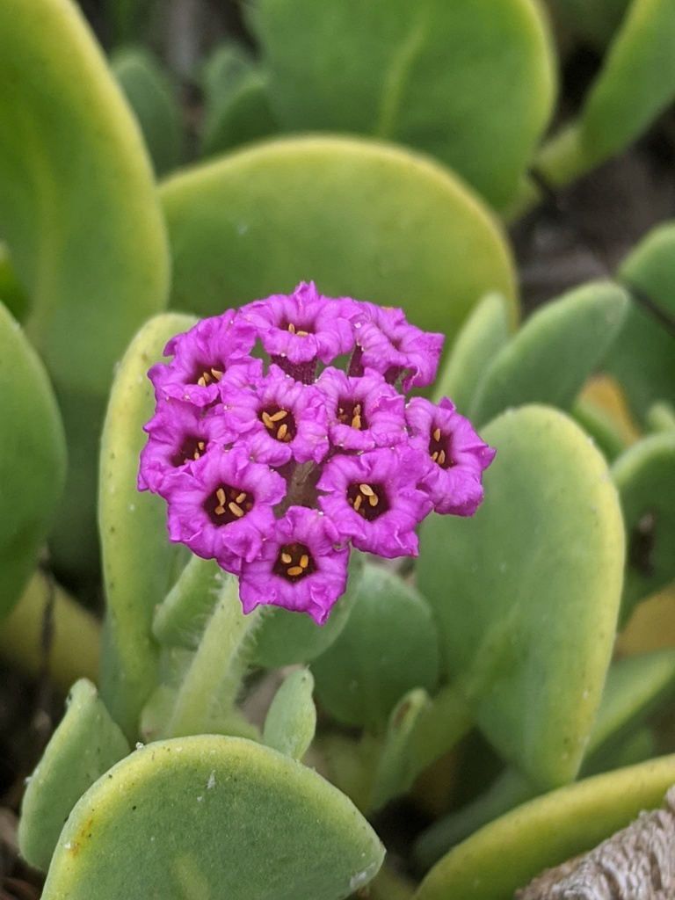

**Common Name:** Red Sand Verbena  
**Scientific Name:** *Abronia maritima*

A low-growing beach plant with clusters of colorful flowers. It grows well in sandy coastal areas.

---

### 17. Cucumberleaf Sunflower

  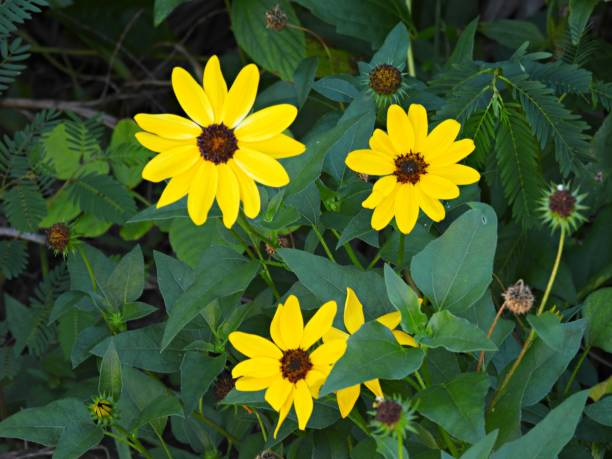

**Common Name:** Cucumberleaf Sunflower  
**Scientific Name:** *Helianthus debilis*

A coastal flowering plant with bright yellow petals and broad leaves. It is often found in sunny sandy areas.

---

### 18. Wedelia

  

**Common Name:** Wedelia  
**Scientific Name:** *Wedelia trilobata*

A creeping groundcover plant with bright yellow flowers. It spreads quickly and is often used as an ornamental plant.

---

### 19. Long-leaf Sea-Lavender

  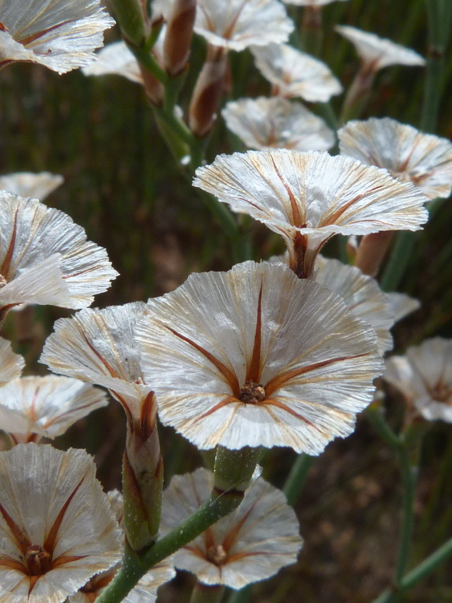

**Common Name:** Long-leaf Sea-Lavender  
**Scientific Name:** *Limonium longifolium*

A flowering coastal plant known for its small purple or lavender flowers. It grows well in salty coastal habitats.

---

### 20. Beach Sandmat

  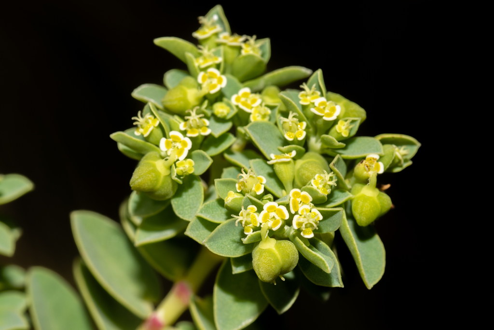

**Common Name:** Beach Sandmat  
**Scientific Name:** *Euphorbia mesembryanthemifolia*

A low-growing plant that spreads across sandy ground. It is adapted to hot, dry, and salty beach environments.

---

## ⚙️ Model Training Details

The image classification model was trained using the following hyperparameters:

- **Epochs:** 80  
- **Batch Size:** 32  
- **Learning Rate:** 0.001  
- **Number of Images per Class:** 250 images or more per class  

The model was trained for **80 epochs** with a **batch size of 32** and a **learning rate of 0.001**. Each plant species contained approximately **250 images**, which helped the model learn the visual patterns of each class from a more balanced dataset. These training settings were selected to improve the model’s classification performance.

---

## 📊 Model Evaluation

This section presents the evaluation results of the trained model. The images below show how well the model classified the plant species.

### Confusion Matrix

The full confusion matrix is shown below. Since the complete output was too wide to fit into one screenshot, the images were arranged closely to appear as one continuous figure.

  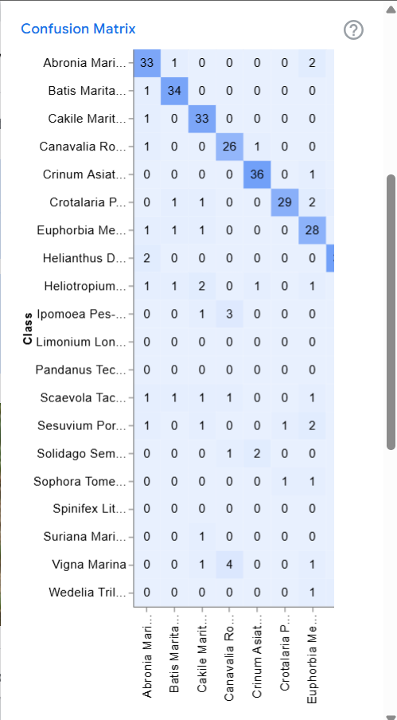
  
  

<em>Full Confusion Matrix</em>

These images help show which plant species were predicted correctly and which were misclassified by the model.

### Accuracy per Class

  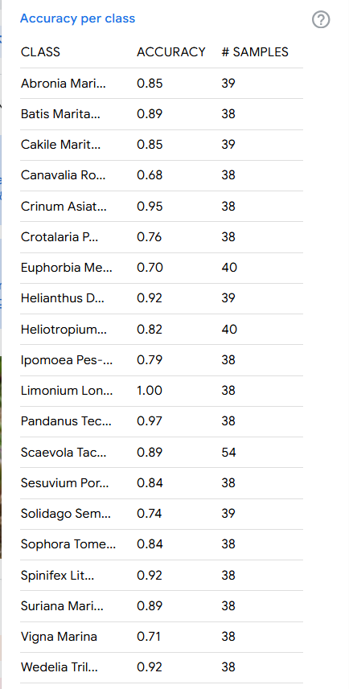

<em>Accuracy per class of the trained model</em>

This figure shows the accuracy of the model for each plant species class.

### Overall Model Accuracy

  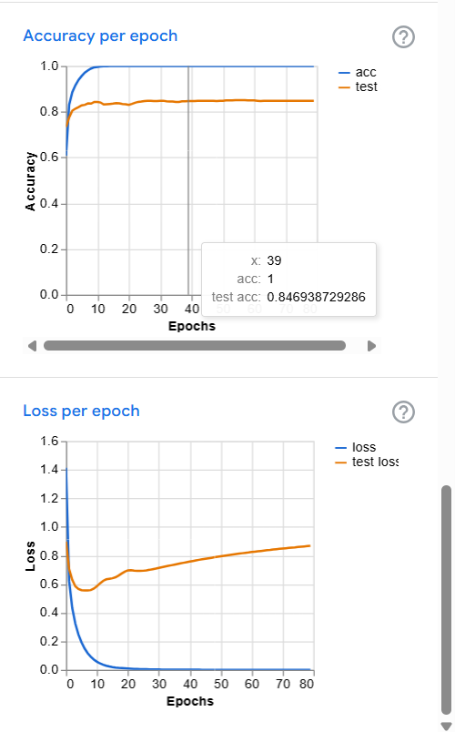

<em>Overall model accuracy graph</em>

This figure shows the overall training performance of the model.

---

## 🧪 Model Testing

In this section, the trained model was tested using sample plant images to see how well it performs on unseen data. Each example includes the sample image and the model’s prediction result.

### Test 1

  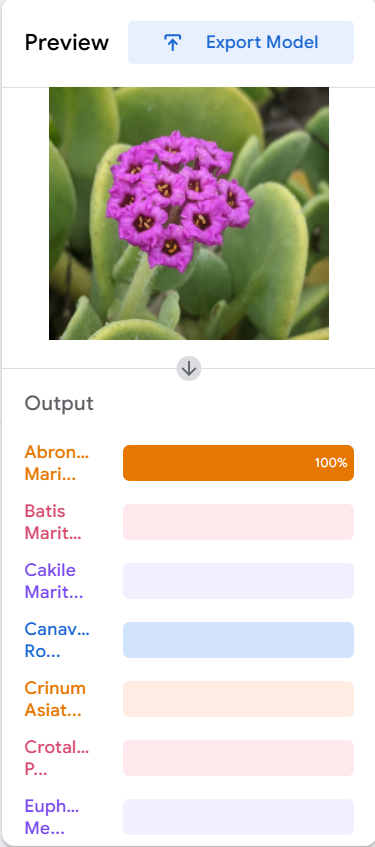

<em>Model prediction result for Test 1</em>

The output shows the predicted class label and confidence score for the given image.

---

### Test 2

  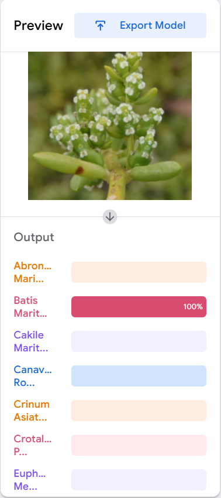

<em>Model prediction result for Test 2</em>

The output shows the predicted class label and confidence score for the given image.

---

### Test 3

  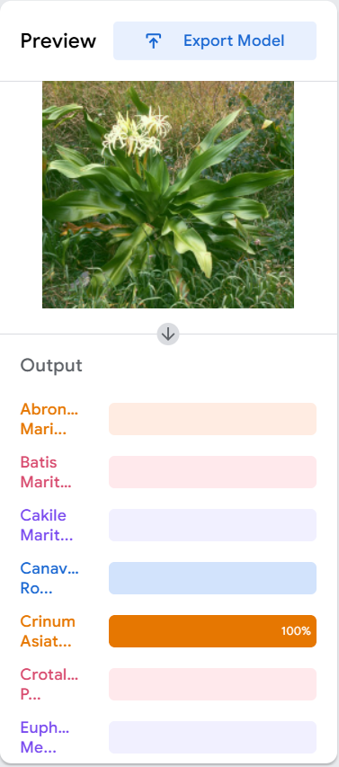

<em>Model prediction result for Test 3</em>

The output shows the predicted class label and confidence score for the given image.

---

### Test 4

  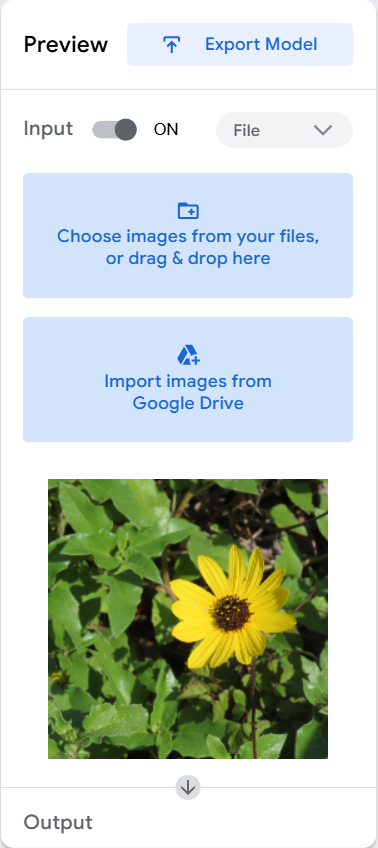
  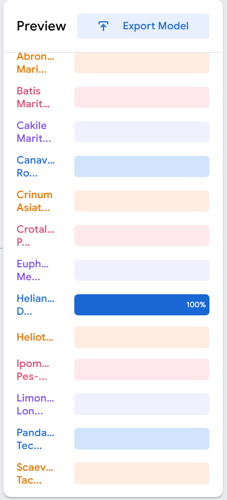

<em>Input image (left) and model prediction result (right)</em>

---

### Test 5

  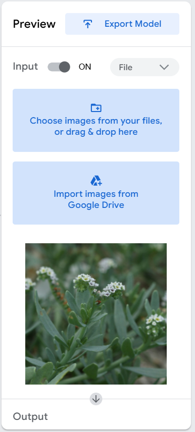
  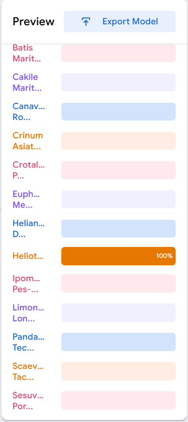

<em>Input image (left) and model prediction result (right)</em>

---

### Test 6

  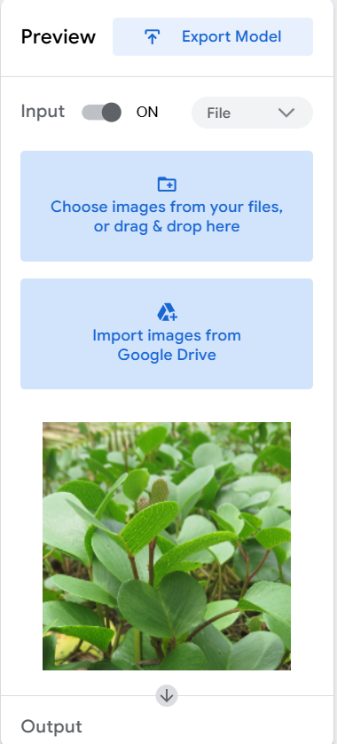
  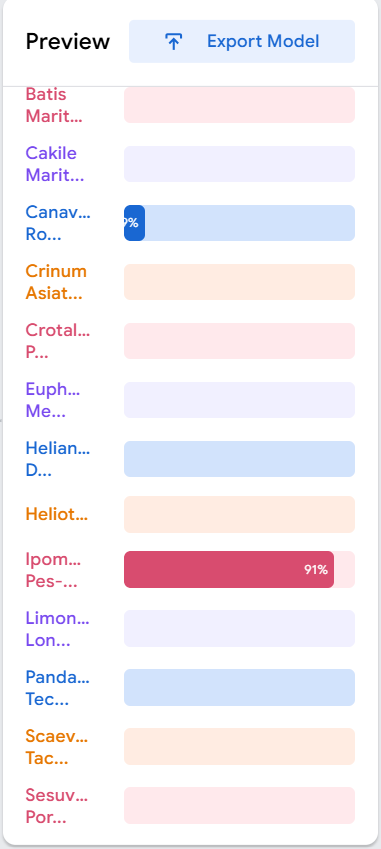

<em>Input image (left) and model prediction result (right)</em>

---

### Test 7

  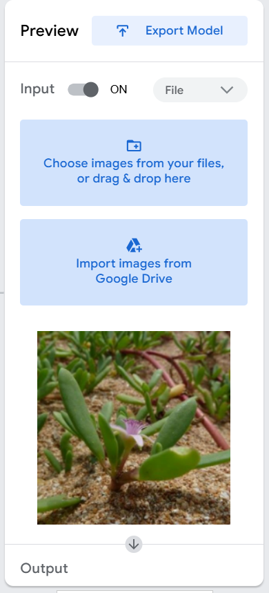
  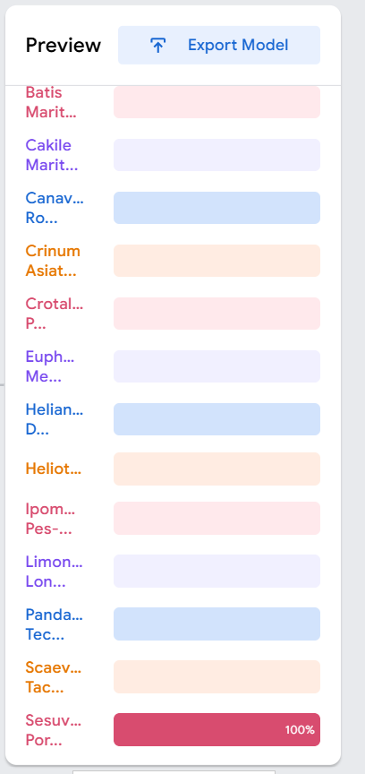

<em>Input image (left) and model prediction result (right)</em>

---

### Test 8

  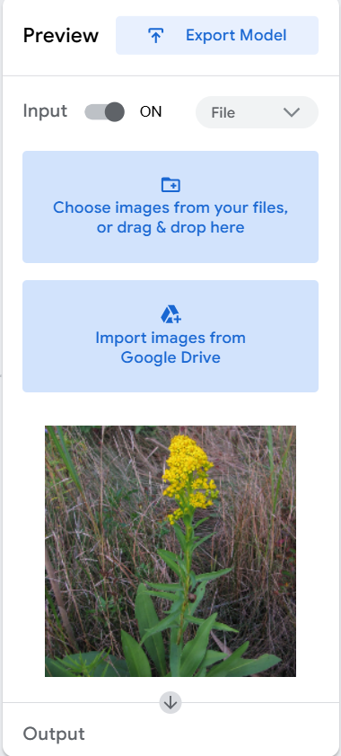
  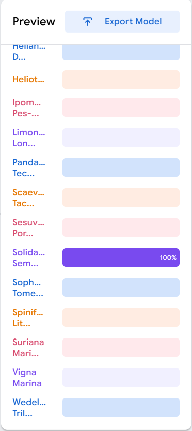

<em>Input image (left) and model prediction result (right)</em>

---

### Test 9

  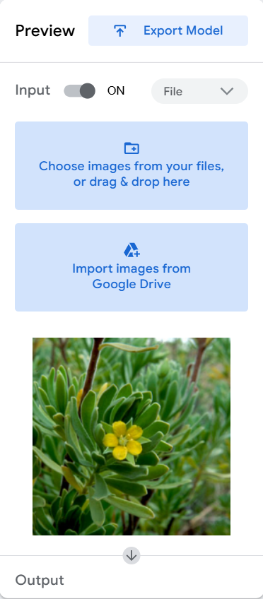
  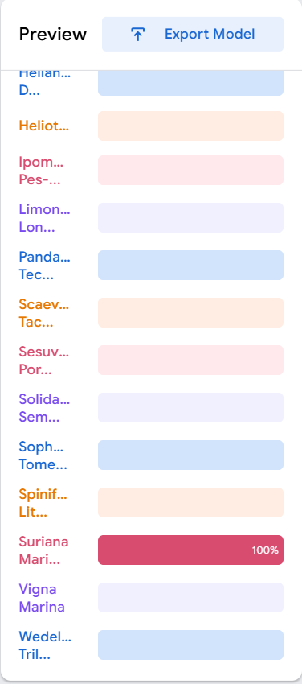

<em>Input image (left) and model prediction result (right)</em>

---

### Test 10

  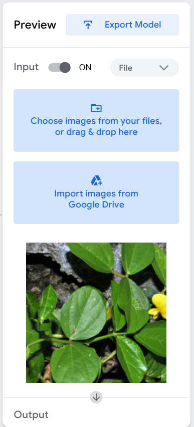
  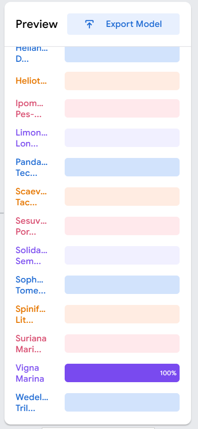

<em>Input image (left) and model prediction result (right)</em>

---

## 💭 Reflection Questions

### 1. How did the number of images per class affect your model’s accuracy?

The number of images per class had a big effect on the model’s accuracy. When a plant species had more images, the model had more examples to study, so it became better at recognizing that class. If a class had fewer or less varied images, the model had a harder time learning its features, which could lower the accuracy.

### 2. Which plant species were most commonly misclassified and why?

The species that were most commonly misclassified were Sophora tomentosa and Vigna marina. Based on my testing, when I used an image where the leaf part was cut and only the flower was clearly shown, the model predicted Sophora tomentosa instead of Vigna marina. I think this happened because the model focused more on the flower that was visible in the picture. Since the image did not show the full plant features, especially the leaves, the model got confused between the two species.

### 3. How did changing the epochs, batch size, or learning rate affect the training results?

Changing the epochs, batch size, and learning rate affected how well the model learned during training. When the number of epochs was higher, the model had more chances to learn from the dataset, but too much training could also make it memorize the data too much. The batch size affected how many images were processed at one time, while the learning rate controlled how fast the model adjusted during training.

### 4. What challenges did you encounter during dataset collection and labeling?

One of the main challenges I encountered was collecting enough clear and good-quality images for each plant species. Some plants were harder to find, and some images had different backgrounds, lighting, or angles, which made the dataset less consistent. Another challenge was labeling the images correctly because some plant species looked very similar, so I had to be careful in organizing them into the right class.

### 5. If you were to improve your model, what specific changes would you make and why?

If I were to improve my model, I would add more images for each plant species, especially for the classes that were often confused by the model. I would also try to collect clearer and more varied images so the model could learn better from different conditions. Aside from that, I would test different hyperparameters like epochs and learning rate to see if the accuracy could still be improved.
