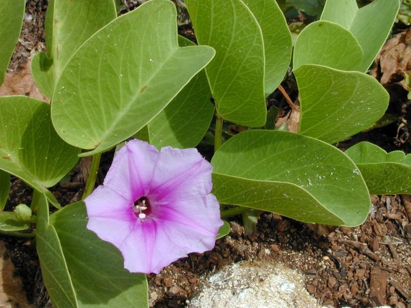
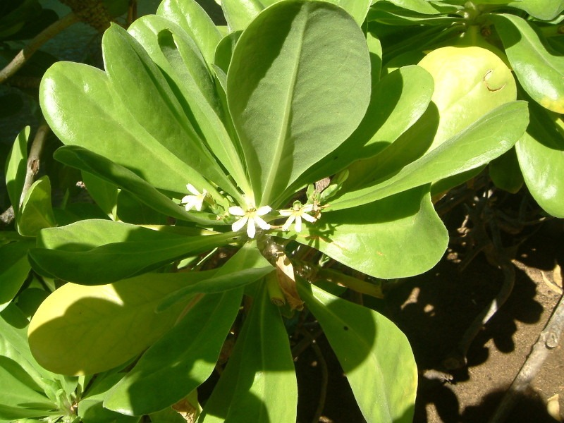
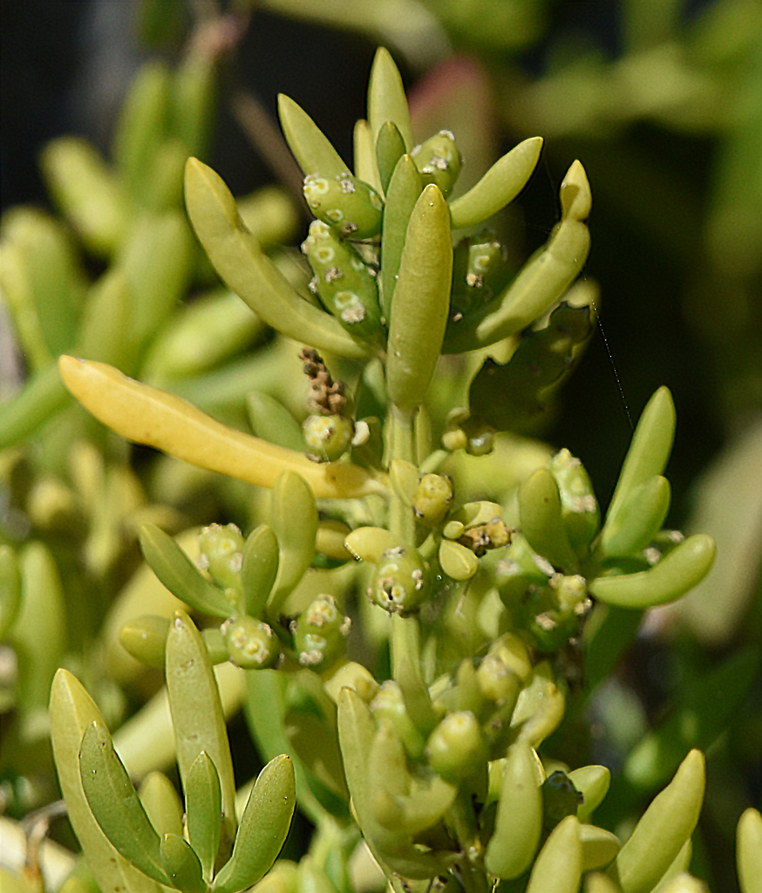
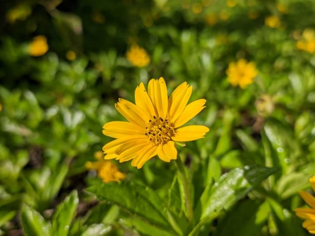

 # Plant Image Classification Using Teachable Machine

## A. Project Overview

This project is about developing an image classification model using **Google Teachable Machine** to recognize **20 related plant species** from images. The model is trained to learn the unique features of each plant species and classify them based on the given image.

The purpose of this image classification model is to identify plant species automatically and accurately. It is intended to make plant recognition easier and more efficient. To show how the model was developed and how well it works, the project also includes the **model training details** and **evaluation results**, such as the **confusion matrix**, **accuracy per class**, and **overall model accuracy**.

## B. Plant Species Section

Below are the **20 related plant species** used in this image classification project. Each plant includes one representative image, its common name, scientific name, and a short description.

---

### 1. Beach Morning Glory

  

- **Common Name:** Beach Morning Glory  
- **Scientific Name:** *Ipomoea pes-caprae*  
- **Description:** A creeping coastal vine commonly found on sandy beaches. It is known for its broad leaves and purple trumpet-shaped flowers.

---

### 2. Scaevola

  

- **Common Name:** Scaevola  
- **Scientific Name:** *Scaevola taccada*  
- **Description:** A coastal shrub with thick green leaves and small white flowers. It is commonly found near shorelines and helps protect coastal areas.

---

### 3. Beach Pandan

  

- **Common Name:** Beach Pandan  
- **Scientific Name:** *Pandanus tectorius*  
- **Description:** A tropical coastal plant with long spiny leaves and large fruit clusters. It grows well in sandy and seaside environments.

---

### 4. Beach Spinifex Grass

  

- **Common Name:** Beach Spinifex Grass  
- **Scientific Name:** *Spinifex littoreus*  
- **Description:** A fast-spreading grass that grows on sand dunes. It helps stabilize sandy soil along the coast.

---

### 5. Seaside Heliotrope

  

- **Common Name:** Seaside Heliotrope  
- **Scientific Name:** *Heliotropium curassavicum*  
- **Description:** A low-growing coastal plant with fleshy leaves and small flowers. It thrives in salty environments near the shore.

---

### 6. Beach Bean

  

- **Common Name:** Beach Bean  
- **Scientific Name:** *Canavalia rosea*  
- **Description:** A trailing vine that grows on sandy beaches. It has thick leaves and pink to purple flowers.

---

### 7. Sea Purslane

  

- **Common Name:** Sea Purslane  
- **Scientific Name:** *Sesuvium portulacastrum*  
- **Description:** A creeping succulent plant with fleshy leaves. It is well adapted to coastal habitats and salty soil.

---

### 8. Beach Pea

  

- **Common Name:** Beach Pea  
- **Scientific Name:** *Vigna marina*  
- **Description:** A coastal legume vine with yellow flowers. It commonly grows on sandy shores and open beach areas.

---

### 9. Beach Lily

  

- **Common Name:** Beach Lily  
- **Scientific Name:** *Crinum asiaticum*  
- **Description:** A flowering coastal plant with long leaves and large white blooms. It is often found in tropical seaside areas.

---

### 10. Seaside Goldenrod

  

- **Common Name:** Seaside Goldenrod  
- **Scientific Name:** *Solidago sempervirens*  
- **Description:** A flowering coastal plant recognized by its bright yellow flower clusters. It is commonly found near dunes and shorelines.

---

### 11. Bay Cedar

  

- **Common Name:** Bay Cedar  
- **Scientific Name:** *Suriana maritima*  
- **Description:** A small coastal shrub with woody branches and yellow flowers. It grows in dry sandy places near the sea.

---

### 12. Yellow Necklace Pod

  

- **Common Name:** Yellow Necklace Pod  
- **Scientific Name:** *Sophora tomentosa*  
- **Description:** A coastal shrub with yellow flowers and bead-like seed pods. It is commonly found in sandy and salty environments.

---

### 13. Sea Rocket

  

- **Common Name:** Sea Rocket  
- **Scientific Name:** *Cakile maritima*  
- **Description:** A hardy coastal plant that grows on sandy beaches. It has fleshy leaves and is well adapted to seaside conditions.

---

### 14. Saltwort

  

- **Common Name:** Saltwort  
- **Scientific Name:** *Batis maritima*  
- **Description:** A salt-tolerant coastal plant with small thick leaves. It is commonly found in marshes and other salty habitats.

---

### 15. Beach Rattlebox

  

- **Common Name:** Beach Rattlebox  
- **Scientific Name:** *Crotalaria pumila*  
- **Description:** A small coastal flowering plant with yellow blossoms. Its seed pods make a rattling sound when dry.

---

### 16. Red Sand Verbena

  

- **Common Name:** Red Sand Verbena  
- **Scientific Name:** *Abronia maritima*  
- **Description:** A low-growing beach plant with clusters of colorful flowers. It grows well in sandy coastal areas.

---

### 17. Cucumberleaf Sunflower

  

- **Common Name:** Cucumberleaf Sunflower  
- **Scientific Name:** *Helianthus debilis*  
- **Description:** A coastal flowering plant with bright yellow petals and broad leaves. It is often found in sunny sandy areas.

---

### 18. Wedelia

  

- **Common Name:** Wedelia  
- **Scientific Name:** *Wedelia trilobata*  
- **Description:** A creeping groundcover plant with bright yellow flowers. It spreads quickly and is often used as an ornamental plant.

---

### 19. Long-leaf Sea-Lavender

  

- **Common Name:** Long-leaf Sea-Lavender  
- **Scientific Name:** *Limonium longifolium*  
- **Description:** A flowering coastal plant known for its small purple or lavender flowers. It grows well in salty coastal habitats.

---

### 20. Beach Sandmat

  

- **Common Name:** Beach Sandmat  
- **Scientific Name:** *Euphorbia mesembryanthemifolia*  
- **Description:** A low-growing plant that spreads across sandy ground. It is adapted to hot, dry, and salty beach environments.
## C. Model Training Details

The image classification model was trained using the following **hyperparameters**:

- **Epochs:** 100  
- **Batch Size:** 32  
- **Learning Rate:** 0.001  
- **Number of Images per Class:** 250 images or more per class  

The model was trained for **100 epochs** with a **batch size of 32** and a **learning rate of 0.001**. Each plant species class contained approximately **250 images**, allowing the model to learn visual patterns from a balanced dataset. These hyperparameters were chosen to help improve the model’s ability to classify plant species accurately.

## Reflection Questions

### 1. How did the number of images per class affect your model’s accuracy?
The number of images per class had a big effect on the model’s accuracy. When a plant species had more images, the model had more examples to study, so it became better at recognizing that class. If a class had fewer or less varied images, the model had a harder time learning its features, which could lower the accuracy.

### 2. Which plant species were most commonly misclassified and why?
The plant species that were most commonly misclassified were usually the ones that looked similar to each other in terms of leaf shape, flower color, or overall appearance. Since many of the plants in this project are coastal plants, some of them share very close visual features. Because of this, the model sometimes confused one species with another, especially when the image quality, angle, or background was not clear.

### 3. How did changing the epochs, batch size, or learning rate affect the training results?
Changing the epochs, batch size, and learning rate affected how well the model learned during training. When the number of epochs was higher, the model had more chances to learn from the dataset, but too much training could also make it memorize the data too much. The batch size affected how many images were processed at one time, while the learning rate controlled how fast the model adjusted during training. These hyperparameters helped improve the training results when they were set properly.

### 4. What challenges did you encounter during dataset collection and labeling?
One of the main challenges I encountered was collecting enough clear and good-quality images for each plant species. Some plants were harder to find, and some images had different backgrounds, lighting, or angles, which made the dataset less consistent. Another challenge was labeling the images correctly because some plant species looked very similar, so I had to be careful in organizing them into the right class.

### 5. If you were to improve your model, what specific changes would you make and why?
If I were to improve my model, I would add more images for each plant species, especially for the classes that were often confused by the model. I would also try to collect clearer and more varied images so the model could learn better from different conditions. Aside from that, I would test different hyperparameters like epochs and learning rate to see if the accuracy could still be improved.
